# multi-token-proactive-market-maker

note: This is a continuation of a group project from summer 2022, and I am now working on it by myself

## Running the code

1. Modify the config JSONs inside the folders for each market type. They follow this form:
```json
{
    "initializer": {
        "init_kwargs": {
            "constant": "// approximate pool size",
            "cap_limit": "// market cap of any single token"
        },
        "token_configs": {
            "token_infos": {
                "traffic_gen": {
                    "// token name, optional entry": {
                        "intype_percent": "// percentage of swaps depositing this token, optional entry",
                        "outtype_percent": "// percentage of swaps removing this token, optional entry"
                    }
                },
                "price_gen": {
                    "// token name": {
                        "start": "// start price",
                        "mean": "// mean % price change, optional entry (default in 'price_gen')",
                        "stdv": "// stdv of price change, optional entry (default in 'price_gen')",
                        "change_probability": "// probability of price change, optional entry (default in 'price_gen')"
                    }
                }
            }
        }
    },
    "traffic": {
        "init_kwargs": {
            "sigma": "// stdv of swap amount (wrt an actual currency)",
            "mean": "// average swap amount (wrt an actual currency)",
            "arb_probability": "// percent of swaps that are purely for arbitrage",
            "shape": "// [num of batches, batch size]; prices change between batches",
            "max_price": "// maximum amount of any swap (wrt an actual currency)",
            "is_norm": "// 'True' if swap amount is normally distributed (else it's uniform from (0, max_price))"
        }
    },
    "price_gen": {
        "init_kwargs": {
            "mean": "// average % of price change",
            "stdv": "// stdv of price change",
            "change_probability": "// probability of price changing",
            "batches": "// num of batches; should match with 'shape' in 'traffic'"
        }
    }
}
```

2. Modifiy the config JSONs for each market maker type. They follow this form:
```json
{
    "type": "market maker type",
    "simulate_kwargs": {
        "reset_tx": "// 'True' if pools are reset after each transaction",
        "arb": "// 'True' if intentional arbitrage swaps will be performed",
        "arb_actions": "// number of arbitrage swaps by each intentional arbitrage action",
        "multi_token": "// 'True' if the market maker does not have pairwise token pools",
        "k": "// '-1' if k values for pools are set randomly; else all pools get this k value",
        "pairwise_monitors": "// pairwise token pools to monitor (displays in graphs), optional entry",
        "multi_monitors": "// token types to monitor (displays in graphs), optional entry"
    }
}
```

3. ```python simulator.py```

## Multi-token proactive market maker

The proactive market maker, or PMM, was first implemented by [DODO Exchange](https://docs.dodoex.io/english/dodo-academy/pmm-overview/the-mathematical-principle-of-pmm). PMM generalizes the commonly used constant product market maker by introducing a parameter $k$ to change the "flatness" of the pricing curve. PMM also splits the price curve into 2 (that is, it is described by 2 functions joined at an intersection point). Coupled with access to a price oracle, this gave the market maker several novel features:

1. Can change the pricing curve's "slope" to increase capital efficiency (k near 0) or to counter volatility (k near 1); $k = 1$ results in the constant product curve
2. Can set an equilibrium pool state where the exchange rate matches the market rate (i.e. the rate derived from dividing the prices of 2 tokens), thus ensuring most swaps happen near market rates
3. Can change the equilibrium point depending on the current pool balances and market exchange rate to reduce impermanent loss
4. Single token type deposits for liquidity providers enabled by splitting of the price curve

Like most market makers, PMM is limited to pairwise token pools. The motivation for designing the multi-token pool version of PMM, or MPMM, was driven by the following 2 hypotheses:

1. The effectiveness of increasing capital efficiency through a low $k$ is positively correlated with the pool's liquidity. Increasing liquidity results in a locally flatter price curve, so there is a greater range of pool states where swapping can happen near market exchange rates.
2. Combining all tokens in a single pool allows losses to spread over all token types, such that the effects of a token failing isn't as significant.

In implementing MPMM, the biggest challenge was creating multi-token equivalents to the methods PMM uses to establish equilibrium points. Most automated market makers use a 2-d curve to represent all pool states, so a multi-dimensional surface might be a reasonable description of pool states in the multi-token setting. However, setting equilibrium points would require the number of computations to at least be on the order of number of token types in the pool. This is computationally infeasible for any blockchain. Instead, MPMM calculates equilibrium point for each swap by minimizing the following expression:

$$(1 - \frac{s}{S})^2 + (1 - \frac{l}{L})^2$$

$l$ and $L$ are the current balance and liquidity provider deposit amount of the first token type, respecitvely, and $s$ and $S$ are the current balance and liquidity provider deposit amount of the second token type, respecitvely. $L$ and $S$ are always known, and $s$ is a function of $l$ that conforms to the price curve given by PMM. This therefore is an optimization solely with respect to $l$. It can be confirmed there exists a closed form result for $l$, though it is not pretty.

## Methods

A total of 10 tokens were used in simulations. Their prices were made to match the 10 largest tokens by market cap at the time of this project (Dogecoin was excluded since its low price resulted in calculations overflowing).

A time series of prices was generated and used across all market maker types. The prices fluctuate according to a $0$ mean normal distriution in the "random" and "volatile" markets (with the latter having a higher standard deviation). For the markets featuring tokens crashing in price, the crashing token prices fluctuations were generated from a normal distribution with a small negative mean and relatively small standard deviation, and all other token type price fluctuations were generated from an identical distribution to the "random" market.

A 2-d array of swaps were generated and used across all market maker types. The 2nd dimension corresponds to all swaps taking place with the same token prices. The swap token types were selected uniformaly at random for the "random" and "volatile" markets. For the markets featuring tokens crashing in price, the crashing tokens were given higher probabilities for the input type and lower probabilities for the output type.

The amount to be inputted into the market makers for each swap, in terms of a standard currency, was generated from a normal distribution with a mean of $10000$, which according to a statistic is average swap amount on Uniswap, and a standard deviation of $5000$. However, there is an upper limit on high much of a token type can be inputted into a market maker. The limit is determined by estimating the amount of the token in the market maker and using the current price to estimate and compare the token's market cap with a predefined cap limit. This ensures that despite a sell off of a crashing price token, a market maker cannot have so much of a token at a given price such that the token has an impossibly large market cap.

Results for capital efficiency, price impact, and impermanent loss were recorded for the market makers. Data was collected after each swap. Capital efficiency was measured by dividing the market makers' exchange rate by the market rate (given by dividing the prices of 2 tokens). Ideal values would be 1 or lower, as that indicates swapping is cheaper in the market maker than the open market. Price impact was measured by dividing the exchange rate after swaps by the exchange rate of the swap. Ideal values would be 1 or lower, since that would mean exchange rates have decreased. Impermanent loss was measured by dividing the current token balance by the initial token balance. Ideal values would be 1 or higher, since that means all of the liquidity providers' deposits are able to be withdrawn.

## Analyzing results: capital efficiency and price impact

AMM refers to the constant product market maker, CSMM refers to constant sum market maker, and PMM refers to proactive market maker. Their counterparts (MAMM, MCSMM, and MPMM) are, respectively, the multi-token pool counterparts.

We first begin by looking at the capital efficiency data (market maker exchange rate divided by market rate), particularly when the exchange rate is above market rate. These numbers were from the "random market" simulation run, though results from the "volatile market" scenario show similar relations. Note that CSMM and MCSMM were excluded from the table, as they both have exchange rates always matching the market rate.

| market maker | median | standard deviation | counts |
| --- | --- | --- | --- |
| AMM | 1.0097587020 | 0.0087386366 | 117320 |
| PMM, k = 0.05 | 1.0004746104 | 0.0004385192 | 118253 |
| PMM, k = 0.25 | 1.0023834005 | 0.0021861559 | 118364 |
| PMM, k = 0.5 | 1.0047493144 | 0.0043586426 | 118371 |
| PMM, k = 0.75 | 1.0071173238 | 0.0064576011 | 118438 |
| MAMM | 1.0007408981 | 0.0051349828 | 100065 |
| MPMM, k = 0.05 | 1.0000128650 | 0.0001996097 | 117278 |
| MPMM, k = 0.25 | 1.0000641116 | 0.0002258061 | 117262 |
| MPMM, k = 0.5 | 1.0001281395 | 0.0049606141 | 117296 |
| MPMM, k = 0.75 | 1.0001911289 | 0.0007047771 | 117384 |

And here are the results with outliers (0.05 % of the data) removed:

| market maker | median | standard deviation | counts |
| --- | --- | --- | --- |
| AMM | 1.0097523441 | 0.0086831076 | 117262 |
| PMM, k = 0.05 | 1.0004742520 | 0.0004357843 | 118194 |
| PMM, k = 0.25 | 1.0023813472 | 0.0021703882 | 118305 |
| PMM, k = 0.5 | 1.0047466231 | 0.0043307971 | 118312 |
| PMM, k = 0.75 | 1.0071129227 | 0.0064179157 | 118379 |
| MAMM | 1.0007403017 | 0.0009003652 | 100015 |
| MPMM, k = 0.05 | 1.0000128601 | 0.0000147415 | 117220 |
| MPMM, k = 0.25 | 1.0000640765 | 0.0000751965 | 117204 |
| MPMM, k = 0.5 | 1.0001280641 | 0.0001496396 | 117238 |
| MPMM, k = 0.75 | 1.0001910016 | 0.0002240519 | 117326 |

Capital efficiency improves significantly going from all pairwise-token market makers to their multi token counterparts. This is simply because increasing the amount of liquidity increases the amount of pool states near the market exchange rate. Holding the swap volume constant, this implies that most swaps are happening near market exchange rates. Related to this is the standard deviation results, which show better performance amongst the multi token models. The data also confirms that the lower $k$ parameter for PMM and MPMM increases capital efficiency on typical swaps due to a flatte price curve. The standard deviation data also suggests this is the case, since increasing $k$ would have more drastic change exchange rates between any 2 pool states.

Now we look at the results for price impact. The values were calculated by dividing the exchange rates before and after the swap (with the post-swap rate determined by a hypotheticlly repeating the same swap). These numbers were again from the "random market" case, and results from the "volatile market" scenario showed similar relations. CSMM and MCSMM data was excluded, as they always have 0 price impact.

| market maker | median | standard deviation | counts |
| --- | --- | --- | --- |
| AMM | 1.0091511241 | 0.0074591293 | 200000 |
| PMM, k = 0.05 | 1.0004640173 | 0.0003776017 | 199999 |
| PMM, k = 0.25 | 1.0023100343 | 0.0018813024 | 199999 |
| PMM, k = 0.5 | 1.0045988589 | 0.0037406223 | 200000 |
| PMM, k = 0.75 | 1.0068647712 | 0.0055719867 | 200000 |
| MAMM | 1.0002546681 | 0.0201696593 | 199863 |
| MPMM, k = 0.05 | 1.0000127590 | 0.0022414722 | 197544 |
| MPMM, k = 0.25 | 1.0000638113 | 0.0000548419 | 197580 |
| MPMM, k = 0.5 | 1.0001277456 | 0.0001094699 | 197608 |
| MPMM, k = 0.75 | 1.0001913983 | 0.0001640858 | 197624 |

And here are the results with outliers (0.05 % of the data) removed:

| market maker | median | standard deviation | counts |
| --- | --- | --- | --- |
| AMM | 1.0091479764 | 0.0073819171 | 199900 |
| PMM, k = 0.05 | 1.0004638835 | 0.0003738808 | 199900 |
| PMM, k = 0.25 | 1.0023094239 | 0.0018620453 | 199900 |
| PMM, k = 0.5 | 1.0045974405 | 0.0037029701 | 199900 |
| PMM, k = 0.75 | 1.0068625912 | 0.0055164919 | 199900 |
| MAMM | 1.0002545844 | 0.0039388632 | 199764 |
| MPMM, k = 0.05 | 1.0000127552 | 0.0000107944 | 197446 |
| MPMM, k = 0.25 | 1.0000637899 | 0.0000537566 | 197482 |
| MPMM, k = 0.5 | 1.0001276979 | 0.0001072674 | 197510 |
| MPMM, k = 0.75 | 1.0001913278 | 0.0001608711 | 197526 |

Because price impact is a measure of how much exchange rates change between swaps, we should expect the price impact and capital efficiency data to yield similar relations. Indeed, that is the case: multi token models perform better, and lower $k$ values for PMM and MPMM decrease price impact.

## Analyzing results: impermanent loss

We will only be looking at when impermanent *loss* occurs. The impermanent results were from the "random market" simulation, though the "volatile market" case will lead to similar conclusions. Values were calculated by dividing the token's balance in the pool after each swap by the starting balance. Note that this was done for every token in every pool (i.e. if there was a BTC, USD pool and BTC, ETH pool, there would be 2 values for BTC).

| market maker | median | standard deviation | minimum | counts |
| --- | --- | --- | --- | --- |
| AMM | 0.9484311288 | 0.0495794958 | 0.7629775000 | 7198418 |
| CSMM | 0.8767590539 | 0.1405276729 | 0.1985908067 | 6503865 |
| PMM, k = 0.05 | 0.9958689495 | 0.0039524474 | 0.9610291320 | 7329100 |
| PMM, k = 0.25 | 0.9958356053 | 0.0039282852 | 0.9529956270 | 7268561 |
| PMM, k = 0.5 | 0.9958245721 | 0.0039160589 | 0.9766657264 | 7224886 |
| PMM, k = 0.75 | 0.9958610859 | 0.0038870544 | 0.9770180894 | 7264662 |
| MAMM | 0.9309584428 | 0.0757402706 | 0.7512191524 | 762632 |
| MCSMM | 0.9878159396 | 0.0143722732 | 0.9240048528 | 866811 |
| MPMM, k = 0.05 | 0.9998582195 | 0.0001670664 | 0.9987884538 | 877496 |
| MPMM, k = 0.25 | 0.9998585347 | 0.0001682030 | 0.9980628556 | 887609 |
| MPMM, k = 0.5 | 0.9998576614 | 0.0001677365 | 0.9981770438 | 891949 |
| MPMM, k = 0.75 | 0.9998592169 | 0.0001675595 | 0.9987968613 | 881254 |

And here are the results with outliers (0.05 % of the data) removed:

| market maker | median | standard deviation | counts |
| --- | --- | --- | --- |
| AMM | 0.9484652813 | 0.0494598584 | 7194819 |
| CSMM | 0.8767590539 | 0.1405276729 | 6503865 |
| PMM, k = 0.05 | 0.9958723676 | 0.0039260920 | 7325436 |
| PMM, k = 0.25 | 0.9958387621 | 0.0039002792 | 7264927 |
| PMM, k = 0.5 | 0.9958273867 | 0.0038896552 | 7221274 |
| PMM, k = 0.75 | 0.9958640006 | 0.0038610954 | 7261030 |
| MAMM | 0.9310243899 | 0.0756841428 | 762251 |
| MCSMM | 0.9878260010 | 0.0143159836 | 866378 |
| MPMM, k = 0.05 | 0.9998583170 | 0.0001650093 | 877058 |
| MPMM, k = 0.25 | 0.9998586170 | 0.0001660944 | 887166 |
| MPMM, k = 0.5 | 0.9998577643 | 0.0001657201 | 891504 |
| MPMM, k = 0.75 | 0.9998593037 | 0.0001656145 | 880814 |

These results show that MPMM significantly outperforms all other market maker models by all metrics. The difference between MPMM and PMM is likely due to a larger amount of tokens in a singular pool (in the case of MPMPM) resulting in losses being proportionally smaller. In fact, considering that CSMM and MCSMM can have their pools entirely drained, and that CSMM has a minimum of around 0.2 while MCSMM only has a minimum around 0.92, this is likely the case. Another interesting observation is how little variability there is for PMM and MPMM over time. This is in part seen from their low standard deviations, but graphing the results better captures this point:

| pairwise pool MM | multi token pool MM |
:-------------------------:|:-------------------------:
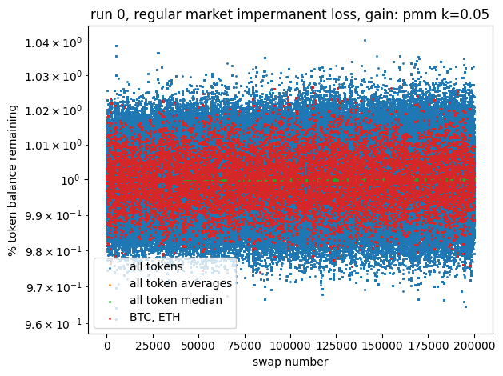 | 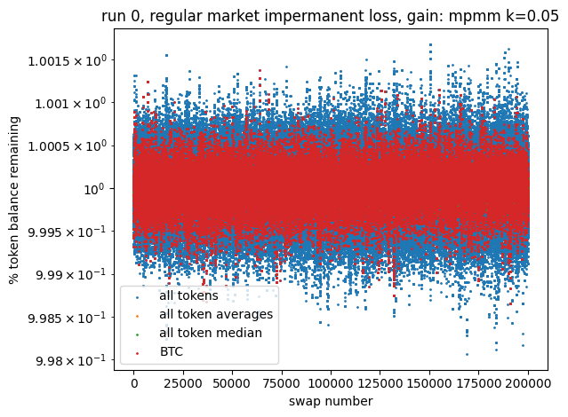
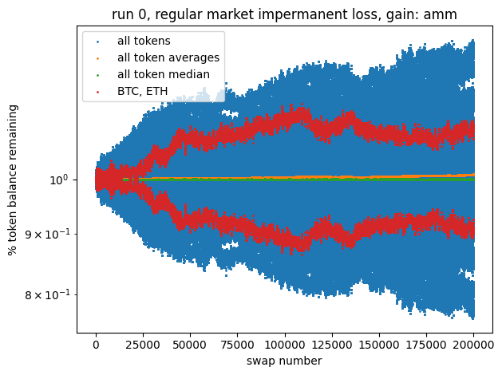 | 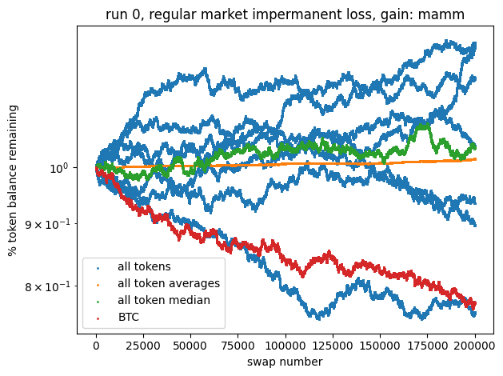
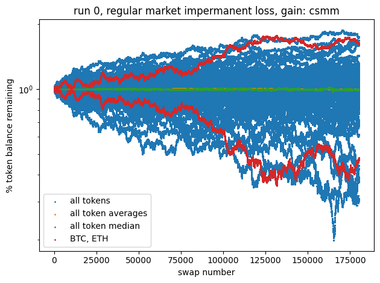 | 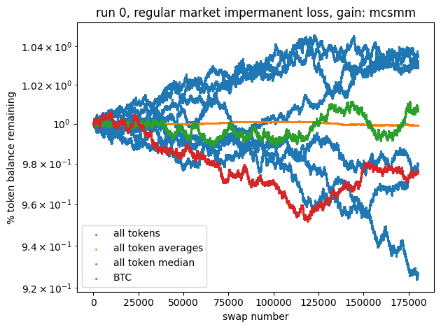

The variance in impermanent loss seems to balloons over time for AMM, MAMM, CSMM, and MCSMM, while PMM and MPMM maintains a steady amount. This indicates that the measure for setting equilibrium points to combat impermanent loss worked as intended in PMM and MPMMM.

## Analyzing results: Impermanent loss when tokens crash

One of the obvious concerns with combining all tokens into 1 pool is exposure to risk. In all pairwise token pool models, if a token fails, only those pools containing the token would be exposed, whereas all tokens in the multi token pool would be exposed. Specifically, the failed token would face a mass sell off where traders dump the token into a market maker for some other token type. Therefore, we want to look at impermanent losses for the other token types. Here are some results for a stablecoin crashing (the non-stablecoin crash scenario yields similar results):

| pairwise pool MM | multi token pool MM |
:-------------------------:|:-------------------------:
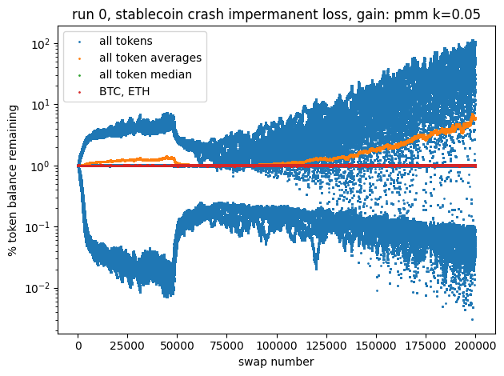 | 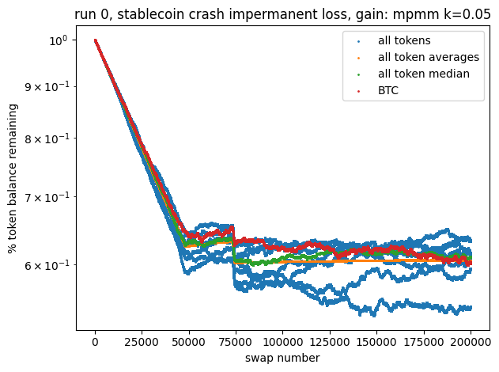
 | 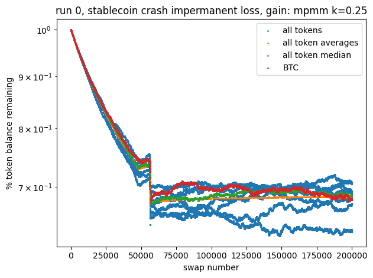
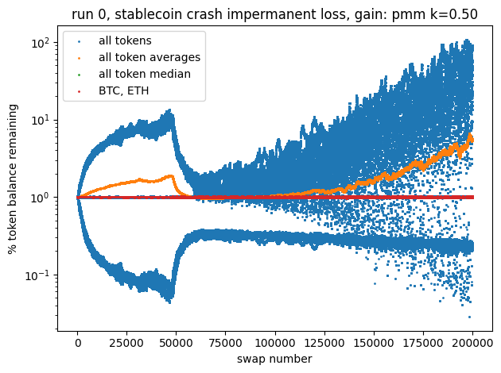 | 
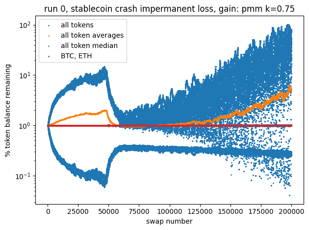 | 
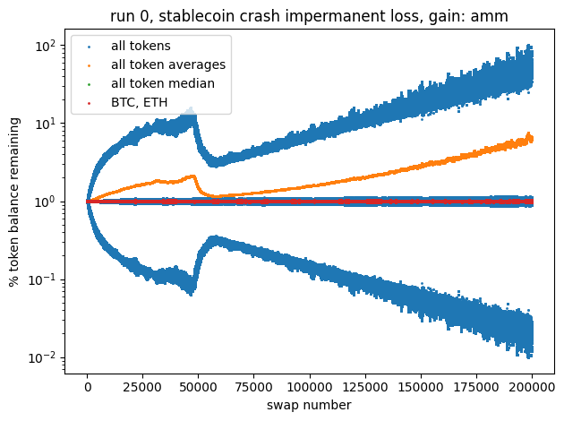 | 
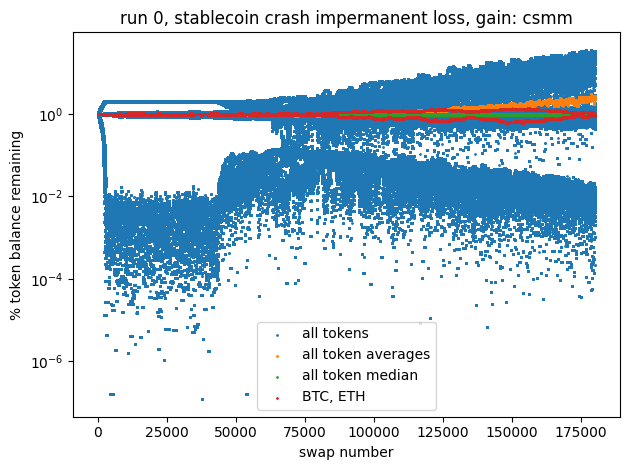 | 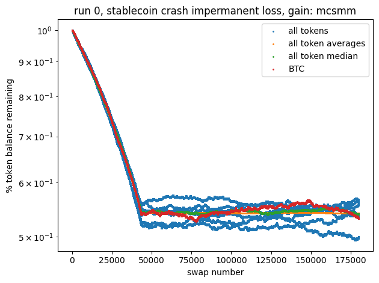

All multi token pool market makers experience losses across all tokens, while their pairwise token pool counterparts only experience losses on some pools. Also, the losses are smaller in magnitude in the multi token market makers, in the sense that large magnitude losses experienced by the pairwise token models are distributed across more token types in a multi token setting.

## Conclusions

These simulations show that MPMM is a viable model for an automated market maker cryptocurrency exchange platform. While it cannot beat CSMM and MCSMM in terms of capital efficiency, it performs exceptionally well in this regard compared to all other models. Additionally, in common market scenarios, MPMM has significantly less impermanent loss than its competitors.

However, the possibility of a token failing and spreading significant losses to all other tokens in a multi token pool must be addressed. Possible solutions might be to constrain only certain "trusted" tokens into a multi token pool, or halting all swapping of a token type if its price is deemed too volatile for a given period of time. The former can be determined by some market cap threshold a token must meet, though that is obviously not foolproof, as in the case of LUNA. The latter can be implemented if access to historical price logs is available, and is the safer option, as a sell off is directly prevented. However, it comes at the cost of inconvenience given how variable cryptocurrency prices are, even in the short term.
